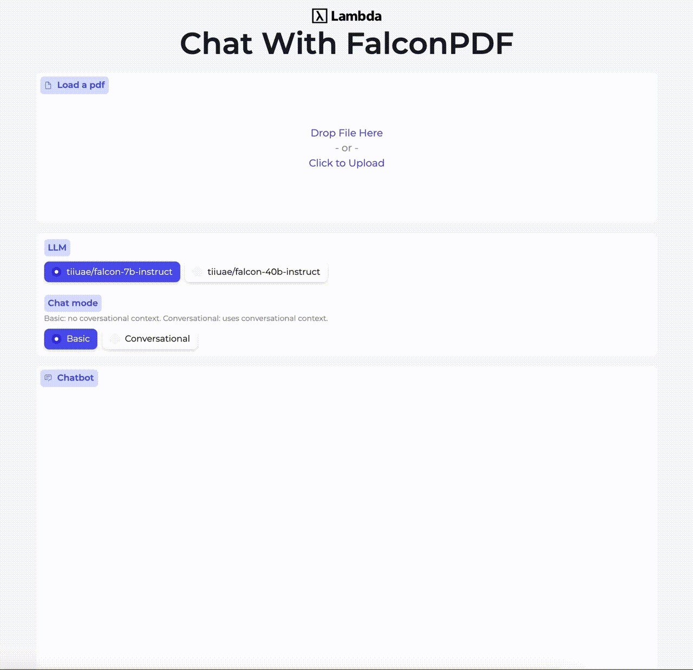
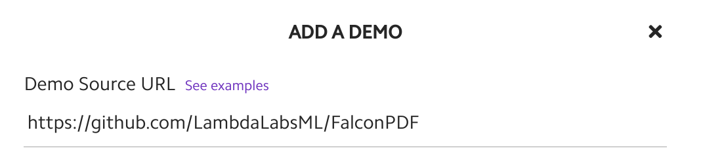

# Chat with PDF using Falcon: Unleashing the Power of Open-Source LLMs!

Unlock the potential of open-source LLMs by hosting your very own langchain+Falcon+Chroma application! Now, you can upload a PDF and engage in captivating Q&A sessions about its contents.

**Try it [here](https://cloud.lambdalabs.com/demos/lambda/FalconPDF) on Lambda Cloud (running on an A10 instance)!**



Disclaimer: This research demo serves for learning purposes and utilizes open-source models for computing both embeddings and output text. Please note that the quality of the answers may not match those obtained through OpenAI APIs.

## Discover Key Features

- End-to-end open-source (embeddings and LLMs). No OpenAI API Key is required!
- Choose between the simplicity of basic Q&A mode or the conversational flow with dialog history.
- Enjoy seamless streaming of answers
- Support concurrent users.

## How to Get Started

Launching the app is a breeze! Launch it from your local machine using:

```
python run.py
```

or host it as a [Lambda Cloud demo](https://cloud.lambdalabs.com/demos) using the URL of this repo:



## The Magic Behind It All

### Overview

The PDF you upload serves as the context for answering your questions. The approach involves storing this context in a Chroma database. By parsing the PDF into text and creating embeddings for chunks of text, we enable easy retrievals later on. When you pose a question, we calculate the question's embedding and compare it with the embedded texts in the database. The most relevant records are then inserted as context to assist our LLM model in generating the final answer.

### Falcon models

This project utilizes the `Falocn-7b-instruct` and `Falcon-40b-instruct` models, which have been fine-tuned on instruct datasets. The 7B model can be hosted on a 24GB GPU machine, while the 40B model needs over 40GB GPU memory (even with 4-bit quantization).

#### Stopping criteria

"StopOnWords" are used to ensure our model doesn't wander endlessly. They halt the generation process when the output contains certain predefined words. Note that "StopOnWords" can be affected by the system prompt, which marks the turns using keywords like `AI:` and `User:`, or `Question:` and `Answer:`. These keywords are usually used as the StopOnWords.

#### Repetition penalty

Increasing the value of the repetition penalty reduces the likelihood of the model repeating a sentence.

#### Randomness

Setting the `temperature` parameter to zero so the answers from the model become deterministic.

### Embedding

This demo uses the sentence-transformers library (MPNet) to calculate the embeddings of the text.

### Modes

The demo has two modes for question-answering:

- Basic Mode: Ideal for straightforward and unrelated questions, free from any pronouns.
- Conversational Mode: Embrace a natural way of asking questions with historical context. Perfect for those intriguing "follow-up" queries that add depth to the conversation.

Remember, the mode you choose depends on your needs and the complexity of the conversation history. Sometimes, simplicity is key!

## Credits

We thank [TII](https://falconllm.tii.ae/) for releasing Falcon models. And [camenduru](https://github.com/camenduru/falcon-40b-instruct-lambda) for a reference Gradio demo implementation with it.
