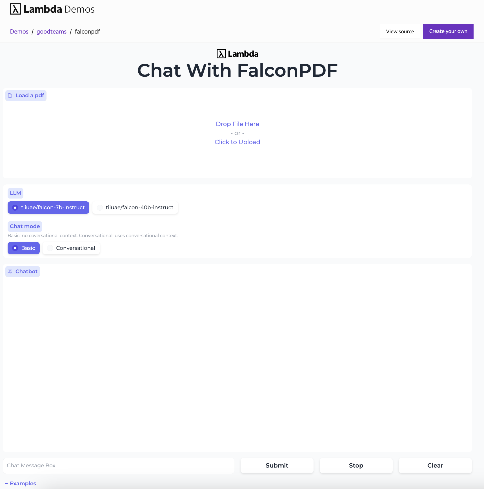
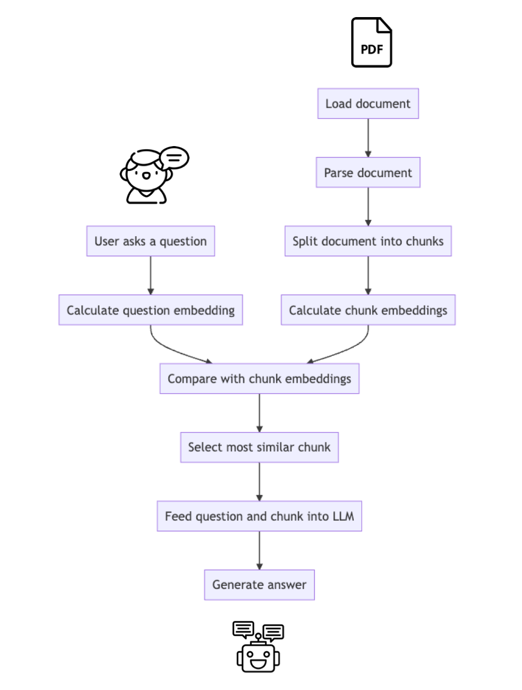

# FalconPDF

FalconPDF is a chatbot that allows users to have context-based conversations using PDF documents as a reference. Unlike simple chatbots, FalconPDF enables users to upload PDF files, which serve as additional context for the conversation. The underlying language model used in this project is Falcon, a large language model (LLM).



### Benefits of FalconPDF

1. **Open source**: Open-source: Falcon is an open-source LLM that offers superior performance and allows for commercial use. By being open-source, FalconPDF ensures secure conversations, data protection, and privacy, which is especially crucial when dealing with personal PDF files as context.

2. **PDF-in-context chatting**: Built on Langchain, FalconPDF enables users to upload PDF documents and utilize their content as context for the conversation. This approach ensures the security and integrity of the PDF files.

3. **Optimized inference and easy installation**:  Large language models often require significant GPU memory. However, Falcon 7B has been optimized using efficient quantization techniques, enabling it to run smoothly on an A10 instance.


## Deployment

This project can be used locally or deployed fastly as a [Lambda demo](https://cloud.lambdalabs.com/demos).

### Local Deployment
```
python run.py
```

### Fast Deployment as Lambda Demo

FalconPDF also provides the option for fast deployment as a Lambda demo. Follow these steps to deploy your own Lambda demo:

1. Go to [https://cloud.lambdalabs.com/demos](https://cloud.lambdalabs.com/demos).
2. Click on "Create your own" and select "Add demo".
3. In the popup window, paste the repository link and choose an instance for hosting the demo.
4. Once the demo is ready, click the demo link on the "instance" page to start chatting!
### Customization

The FalconPDF project is primarily based on the Falcon 7B model, which strikes a balance between quality, speed, and resource usage. However, if you prefer to test the Falcon 40B model, you can easily switch by uncommenting the following line in `run.py`:

```python
model_names = ["tiiuae/falcon-7b-instruct", "tiiuae/falcon-40b-instruct"]   # <-- add the 40B model here
```

Feel free to explore and customize the project according to your specific needs!

## Usage

1. Upload PDFs to use as context for questions 
2. Type a question in the input box and submit to get Falcon's answer

Optionally:
3. Use different Falcon models (Falcon-7B or Falcon-40B). 
4. Choose chat mode between `basic` or `conversational`.
5. Use `example questions` for ideas. Try asking "What is the summary of the document?" as a starting point.

## Technical details
### Document-based question answering
The PDFs, or other documents, serve as the context for question answering. In this project, the context is stored using the Chroma database. While simple files like .txt can be loaded directly, PDF files need to be parsed using tools designed for unstructured data. The documents are then split into chunks, which are used for subsequent retrieval. When a user asks a question, the embedding of the question is calculated and compared with the embeddings of the chunks. The most similar chunk is selected, and the question is fed into the LLM (Language Model) model to obtain the answer.



### Falcon models
This project utilizes the `Falocn-7b-instruct` and `Falcon-40b-instruct` models, which have been fine-tuned on instruct datasets.

#### Stopping criteria
To prevent the model from generating an infinite loop, a stopping criteria called `StopOnWords` is used. This criteria stops the generation process when the generated text contains one of the words in the predefined list. Please note that the stopping words can be affected by the system prompt. For example, a simple AI/User conversation may use `AI:` and `User:` as stopping words, while for question answering tasks, the stopping words may be `Question:` and `Answer:`.

#### Randomness
The randomness in the output is a result of both the inherent randomness of the model and the sampling process.

#### Repetition penalty
In some cases, the model may repeat a sentence indefinitely. To address this issue, a repetition penalty is applied. Increasing the value of the repetition penalty reduces the likelihood of the model repeating a sentence.

### Embedding
This project uses the sentence-transformers library (MPNet) to calculate the embeddings of the questions and chunks. Sentence-transformers is a library for computing sentence embeddings, which are then compared using cosine similarity to find sentences with similar meanings. There are flexible options available for the embedding calculation.

### Langchain retrieval-based question answering

#### Basic retrieval
In the Langchain framework, basic retrieval-based question answering works as described above. In each round, the user asks a clear question, and the model responds with an answer. It's important to note that this mode does not consider conversation history or support multi-round interactions.

#### Conversational retrieval
Conversational retrieval-based question answering is similar to basic retrieval-based question answering, but with the added consideration of conversation history. This enables more complex conversations like the following example:

```
(Given the PDF document about a government policy)

User: What is the motivation of the document?
Bot: The motivation of the document is to provide information to the government about the application and to help them make a decision on whether to grant the visa or not.

User: What affects the decision?
Bot: The decision is based on the information provided in the application form and the supporting documents. The applicant must provide all the necessary information and documents to enable UK Visas and Immigration to make a decision. If the applicant does not provide all the necessary information and documents, the application may be refused.
```

In the second question, the term "decision" refers to the "decision" mentioned in the first question. This is possible because the model takes the conversation history into consideration.

#### Which mode to choose?
- Basic mode: Use this mode when you can provide a clear and simple question that is not related to the conversation history. For example, questions without pronouns.
- Conversational mode: Choose this mode when you want to ask questions based on the conversation history or when you prefer a more natural way of asking questions. It's important to note that conversational mode is not always superior to basic mode. In some cases, the model may be more influenced by the conversation history than the current question, especially when the user asks a new question.

## TODO
Some future work:
- [ ] Implement streaming for a more natural user experience.
- [ ] Add more advanced options, such as different embedding methods.
- [ ] Explore powerful PDF indexing tools.


## Credits
Some of the work are based on the following projects:
- Falcon: https://falconllm.tii.ae/
- https://github.com/camenduru/falcon-40b-instruct-lambda